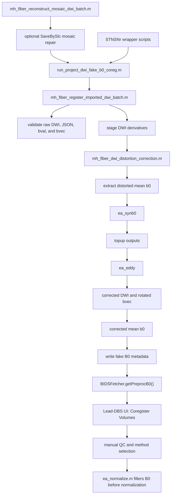

# Fake B0 UI-coreg tutorial for project DWI preprocessing

This tutorial describes how to run and review the project-agnostic DWI workflow
that generates a corrected DWI series and exposes the corrected mean b0 as a
Lead-DBS pseudo `B0` volume for UI-based coregistration. STNSNr paths and
subjects are examples only; reusable code should be called with project-specific
`StudyRoot`, `SubjectIds`, and optional `ImportLog` values.

## Prerequisites

- Lead-DBS repository:
  `/Users/mojackhu/Github/leaddbs`
- Study root containing Lead-DBS-compatible `rawdata` and `derivatives`
  directories.
- Imported DWI data in BIDS-compatible `rawdata/sub-<ID>/ses-preop/dwi/`
  directories.
- Conda environment for Lead-DBS work: `leaddbs`.
- Docker Desktop or Singularity for Synb0-DISCO.
- Synb0-DISCO image:
  `leonyichencai/synb0-disco:v3.1`
- FreeSurfer license. The local installation includes:
  `/Applications/freesurfer/8.2.0/license.txt`
- Docker Desktop memory of at least 12 GB for the default Synb0 preflight.

The documentation assumes that the DWI import step has already copied valid DWI,
JSON, bval, and bvec files into `rawdata`.

## Function call graph



## Main entry points

`run_project_dwi_fake_b0_coreg.m` is the project-agnostic fake-B0 entry point.
It expects a project `StudyRoot` and either explicit `SubjectIds`, a copied-DWI
`ImportLog`, or discoverable BIDS DWI files under `rawdata/sub-*/ses-preop/dwi/`.

`run_stnsnr_dwi_registration.m` and `run_stnsnr_dwi_synb0_bbr_pilot.m` are thin
STNSNr wrappers. They only provide STNSNr paths and pilot subject choices before
calling the project-agnostic runner.

`mh_fiber_register_imported_dwi_batch.m` is the batch implementation. The key
parameters for the fake-B0 workflow are:

```matlab
'DistortionCorrection', 'synb0'
'RunCoregistration', false
'CoregistrationTag', 'dwi_synb0_fakeb0'
'Synb0MinDockerMemoryGB', 12
'Synb0WorkRoot', '/Users/mojackhu/Library/Caches/leaddbs/stnsnr_synb0_work'
```

`mh_fiber_dwi_distortion_correction.m` runs the Synb0-DISCO, topup, eddy, and
corrected-b0 extraction steps.
When the project is stored on an external volume, `Synb0WorkRoot` can place the
Docker-mounted `INPUTS` and `OUTPUTS` staging directories on a local user path.
The completed Synb0 run is then archived back into the project
`work/synb0_eddy` directory before eddy is called, so downstream derivatives
remain project-local.

`mh_fiber_reconstruct_mosaic_dwi.m` repairs one Siemens `SaveBySlc` tiled DWI
set before it is used as a normal BIDS DWI input. `mh_fiber_infer_mosaic_geometry.m`
derives `TileSize`, `TileGrid`, and `SliceCount` from DICOM metadata when
available. `mh_fiber_reconstruct_mosaic_dwi_batch.m` applies the same repair to
multiple independent inputs. The default Siemens tile order for this workflow is
`row_major_right_to_left`, meaning slices are read from right to left within
each mosaic row, with rows processed from top to bottom.

`BIDSFetcher.getPreprocB0()` exposes
`preprocessing/dwi/*_desc-preproc_b0.nii` as the Lead-DBS pseudo `B0` modality.

`ea_normalize.m` removes pseudo `B0` inputs before dispatching to normalization
backends.

## Project-agnostic pilot command

Run a pilot subject from MATLAB in the `leaddbs` environment:

```matlab
repoDir = '/Users/mojackhu/Github/leaddbs';
addpath(genpath(repoDir));

result = run_project_dwi_fake_b0_coreg( ...
    'StudyRoot', '/path/to/project', ...
    'RepoDir', repoDir, ...
    'PilotSubject', 'SubA', ...
    'FreeSurferLicense', '/Applications/freesurfer/8.2.0/license.txt', ...
    'Force', true);
```

The equivalent STNSNr example is:

```matlab
repoDir = '/Users/mojackhu/Github/leaddbs';
addpath(genpath(repoDir));

result = run_project_dwi_fake_b0_coreg( ...
    'StudyRoot', '/Volumes/VAL/STNSNr', ...
    'RepoDir', repoDir, ...
    'ImportLog', fullfile('/Volumes/VAL/STNSNr', 'derivatives', 'leaddbs', ...
        'import_logs', 'dwi_import_20260701_013240.csv'), ...
    'PilotSubject', 'ChenMeiJu', ...
    'Force', true);
```

`CoregistrationMethod` is retained as a batch parameter, but it is not used when
`RunCoregistration=false`. The anatomical alignment is performed later in the
Lead-DBS UI.

## Batch command template

After the pilot passes QC, the same workflow can be applied to an explicit
subject list:

```matlab
repoDir = '/Users/mojackhu/Github/leaddbs';
addpath(genpath(repoDir));

subjectIds = {'SubA', 'SubB', 'SubC'};

result = run_project_dwi_fake_b0_coreg( ...
    'StudyRoot', '/path/to/project', ...
    'RepoDir', repoDir, ...
    'SubjectIds', subjectIds, ...
    'FreeSurferLicense', '/Applications/freesurfer/8.2.0/license.txt', ...
    'Force', false);
```

Use `Force=true` only when intentionally rerunning a subject and replacing the
current derived outputs.

If `SubjectIds` is omitted, subjects are resolved in this order: copied subjects
from `ImportLog` when provided, then BIDS DWI files discovered under
`StudyRoot/rawdata/sub-*/ses-preop/dwi/`.

## STNSNr full re-import and fake-B0 preprocessing

The STNSNr cohort refresh uses one controlled runner to rewrite DWI `rawdata`,
remove stale DWI derivatives, and run Synb0-DISCO, topup, and eddy until the
corrected pseudo `B0` is ready for Lead-DBS UI coregistration.

```bash
matlab -batch "cd('/Users/mojackhu/Github/leaddbs'); addpath(genpath(pwd)); run('/Users/mojackhu/Github/leaddbs/my_helper/fiber/stnsnr/run_stnsnr_dwi_reimport_preprocess_fakeb0.m')"
```

The runner imports the 16 `subj_effect.xlsx` subjects in cohort order:

```text
LinJia
HuFengXian
YuDongJian
WuYueFen
LiPing
MaoXiaoMing
ShengGuoLiang
ZhangXiaoHong
ZhengXiangQuan
ZhaoPeiGen
ChenLingHua
FanDongDong
HuangDan
ZhangMing
GengHui
ChenMeiJu
```

Before copying, existing target DWI files are moved to macOS Trash under a
timestamped `stnsnr_dwi_reimport_<timestamp>` directory. The runner moves only
the target DWI rawdata files, subject `preprocessing/dwi` contents, and existing
pseudo `B0` coregistration files. It preserves anatomical anchor images,
normalization transforms, non-B0 anatomical coregistration files, and the
provenance copy in `/Volumes/VAL/STNSNrdwi`.

The rawdata import writes:

```text
/Volumes/VAL/STNSNr/rawdata/sub-<ID>/ses-preop/dwi/sub-<ID>_ses-preop_dwi.nii.gz
/Volumes/VAL/STNSNr/rawdata/sub-<ID>/ses-preop/dwi/sub-<ID>_ses-preop_dwi.json
/Volumes/VAL/STNSNr/rawdata/sub-<ID>/ses-preop/dwi/sub-<ID>_ses-preop_dwi.bval
/Volumes/VAL/STNSNr/rawdata/sub-<ID>/ses-preop/dwi/sub-<ID>_ses-preop_dwi.bvec
```

The preprocessing run uses:

```matlab
'DistortionCorrection', 'synb0'
'RunCoregistration', false
'CoregistrationTag', 'dwi_synb0_fakeb0'
'FreeSurferLicense', '/Applications/freesurfer/8.2.0/license.txt'
'PhaseEncodingVector', [0 1 0]
'DefaultTotalReadoutTime', 0.05
'Synb0WorkRoot', '/Users/mojackhu/Library/Caches/leaddbs/stnsnr_synb0_work'
'Parallel', false
'MaxConcurrentSynb0', 1
'Force', true
```

If a source JSON does not contain a usable total readout time, the runner uses
`DefaultTotalReadoutTime=0.05`. If a source JSON does not contain a usable phase
encoding direction, the runner uses `PhaseEncodingVector=[0 1 0]`. These defaults
must be reviewed if the scanner protocol or DWI conversion changes.

Successful subjects end with:

```text
status=pending_ui_coregistration
coregistration_status=pending_ui
```

The expected corrected outputs are:

```text
/Volumes/VAL/STNSNr/derivatives/leaddbs/sub-<ID>/preprocessing/dwi/sub-<ID>_ses-preop_desc-preproc_dwi.nii
/Volumes/VAL/STNSNr/derivatives/leaddbs/sub-<ID>/preprocessing/dwi/sub-<ID>_ses-preop_desc-preproc_dwi.bval
/Volumes/VAL/STNSNr/derivatives/leaddbs/sub-<ID>/preprocessing/dwi/sub-<ID>_ses-preop_desc-preproc_dwi.bvec
/Volumes/VAL/STNSNr/derivatives/leaddbs/sub-<ID>/preprocessing/dwi/sub-<ID>_ses-preop_desc-preproc_b0.nii
```

The import and cleanup logs are written under:

```text
/Volumes/VAL/STNSNr/derivatives/leaddbs/import_logs/dwi_import_<timestamp>.csv
/Volumes/VAL/STNSNr/derivatives/leaddbs/import_logs/dwi_reimport_cleanup_<timestamp>.csv
```

After this step, continue in the Lead-DBS UI and run `Coregister Volumes` for the
pseudo `B0`. SPM is the usual first-choice method, but the final method should be
selected by manual QC.

## DICOM DWI conversion

Use `mh_fiber_convert_dicom_dwi_to_leaddbs.m` when the source is a DWI DICOM
folder rather than an already converted BIDS DWI set. The function runs
`dcm2niix`, selects the complete DWI four-file set, and writes Lead-DBS/BIDS
compatible output names. If the converted NIfTI is a single-slice SaveBySlc
mosaic, the function calls the reusable mosaic reconstruction backend before
writing the final output.

```matlab
result = mh_fiber_convert_dicom_dwi_to_leaddbs( ...
    'DicomDir', '/path/to/dwi_dicoms', ...
    'OutputDir', '/path/to/rawdata/sub-SubA/ses-preop/dwi', ...
    'OutputBase', 'sub-SubA_ses-preop_dwi', ...
    'RepoDir', '/Users/mojackhu/Github/leaddbs', ...
    'TileOrder', 'row_major_right_to_left', ...
    'Parallel', true, ...
    'ParallelWorkers', 4, ...
    'Force', false);
```

The final output is:

```text
<OutputDir>/<OutputBase>.nii.gz
<OutputDir>/<OutputBase>.json
<OutputDir>/<OutputBase>.bval
<OutputDir>/<OutputBase>.bvec
<OutputDir>/<OutputBase>_dicom_conversion_qc.json
```

The conversion decision is:

1. Run `dcm2niix` into a temporary working directory.
2. Select the converted DWI candidate with matching `.nii.gz`, `.json`,
   `.bval`, and `.bvec` files.
3. If the converted NIfTI has `dimZ > 1`, copy it directly to the requested
   Lead-DBS/BIDS output names.
4. If the converted NIfTI has `dimZ == 1`, call
   `mh_fiber_reconstruct_mosaic_dwi.m` with the same DICOM directory and write
   the repaired 4D DWI.
5. Validate the final NIfTI, bval, and bvec counts.

The batch entry point accepts one row per DICOM folder:

```matlab
inputs = table( ...
    ["SubA"; "SubB"], ...
    ["/path/to/subA/dicom"; "/path/to/subB/dicom"], ...
    ["/path/to/subA/dwi"; "/path/to/subB/dwi"], ...
    ["sub-SubA_ses-preop_dwi"; "sub-SubB_ses-preop_dwi"], ...
    'VariableNames', {'Subject', 'DicomDir', 'OutputDir', 'OutputBase'});

status = mh_fiber_convert_dicom_dwi_to_leaddbs_batch(inputs, ...
    'RepoDir', '/Users/mojackhu/Github/leaddbs', ...
    'TileOrder', 'row_major_right_to_left', ...
    'Parallel', true, ...
    'ParallelWorkers', 4, ...
    'Force', false);
```

This converter does not run Synb0-DISCO, topup, eddy, or Lead-DBS
coregistration. It only prepares a valid raw DWI four-file set for the existing
preprocessing workflow.

## SaveBySlc mosaic reconstruction

Some Siemens `SaveBySlc` DWI exports can appear as a single-slice NIfTI with a
large in-plane matrix, such as `972 x 945 x 1 x 66`. These are tiled mosaic
frames, not normal 3D slice stacks. They must be repaired before the
Synb0-DISCO, topup, and eddy workflow.

The reusable repair entry point is:

```matlab
result = mh_fiber_reconstruct_mosaic_dwi( ...
    'SourceNifti', '/path/to/sub-SubA_bad_mosaic.nii.gz', ...
    'SourceJson', '/path/to/sub-SubA_bad_mosaic.json', ...
    'SourceBval', '/path/to/sub-SubA_bad_mosaic.bval', ...
    'SourceBvec', '/path/to/sub-SubA_bad_mosaic.bvec', ...
    'DicomDir', '/path/to/source_dicom_series', ...
    'OutputDir', '/path/to/repaired_dwi', ...
    'OutputBase', 'sub-SubA_ses-preop_dwi', ...
    'TileOrder', 'row_major_right_to_left', ...
    'Parallel', true, ...
    'ParallelWorkers', 4, ...
    'Force', false);
```

The geometry inference order is:

1. DICOM metadata from `DicomDir`;
2. same-protocol `ReferenceNifti`;
3. explicit `TileSize`, `TileGrid`, and `SliceCount`.

DICOM is preferred because it can provide the full mosaic frame size, tile
matrix, and total slice count. For the STNSNr 64-direction SaveBySlc data, the
expected inference is:

```text
Rows=945
Columns=972
AcquisitionMatrix=[108; 0; 0; 105]
NumberOfSlices=5148
VolumeCount=66
TileSize=[108 105]
TileGrid=[9 9]
SliceCount=78
Output size=108 x 105 x 78 x 66
```

The default tile readout order is `row_major_right_to_left`. This reads each
row from the right side of the mosaic image to the left side, then advances from
the top row to the bottom row. Earlier left-to-right reconstructions of the
STNSNr `GengHui` and `ZhaoPeiGen` SaveBySlc files are rejected and must not be
used as preprocessing inputs. Use the restored original single-slice four-file
sets as the source when rerunning repair.

The reconstructed NIfTI affine is rebuilt from DICOM orientation and spacing
rather than copied from the single-slice mosaic header. The backend reads
`ImageOrientationPatient`, `PixelSpacing`, and `SpacingBetweenSlices` to set the
3D slice-stack axes. If `ImagePositionPatient` is missing, as in the current UIH
SaveBySlc data, the output uses `AffineOriginPolicy=centered_no_dicom_ipp` and
records this fallback in JSON.

The backend also validates the FSL bvec file against DICOM
`DiffusionGradientOrientation`. The expected image-space bvec is computed as:

```text
diag([1 -1 1]) * [row; col; normal] * DICOMGradient
```

where `row` and `col` come from `ImageOrientationPatient` and `normal` is
`cross(row, col)`. The bvec file is copied unchanged only when the non-b0
gradient mismatch is below threshold. Otherwise reconstruction stops before
writing final outputs.

The batch entry point accepts an input table with source paths and writes one
status row per subject:

```matlab
inputs = table( ...
    ["SubA"; "SubB"], ...
    ["/path/to/sub-SubA_bad_mosaic.nii.gz"; "/path/to/sub-SubB_bad_mosaic.nii.gz"], ...
    ["/path/to/sub-SubA_bad_mosaic.json"; "/path/to/sub-SubB_bad_mosaic.json"], ...
    ["/path/to/sub-SubA_bad_mosaic.bval"; "/path/to/sub-SubB_bad_mosaic.bval"], ...
    ["/path/to/sub-SubA_bad_mosaic.bvec"; "/path/to/sub-SubB_bad_mosaic.bvec"], ...
    ["/path/to/sub-SubA_dicoms"; "/path/to/sub-SubB_dicoms"], ...
    ["/path/to/repaired/sub-SubA"; "/path/to/repaired/sub-SubB"], ...
    ["sub-SubA_ses-preop_dwi"; "sub-SubB_ses-preop_dwi"], ...
    'VariableNames', {'Subject', 'SourceNifti', 'SourceJson', 'SourceBval', ...
    'SourceBvec', 'DicomDir', 'OutputDir', 'OutputBase'});

status = mh_fiber_reconstruct_mosaic_dwi_batch(inputs, ...
    'TileOrder', 'row_major_right_to_left', ...
    'Parallel', true, ...
    'ParallelWorkers', 4, ...
    'Force', false);
```

The STNSNr wrapper uses the same backend and only supplies project-specific
paths for `GengHui` and `ZhaoPeiGen`:

```matlab
repoDir = '/Users/mojackhu/Github/leaddbs';
addpath(genpath(repoDir));

status = run_stnsnr_reconstruct_savebyslc_dwi( ...
    'RepoDir', repoDir, ...
    'RepairRoot', fullfile('/Volumes/VAL/STNSNr', 'derivatives', ...
        'leaddbs', 'import_logs', 'savebyslc_repair'), ...
    'ReplaceRawdata', false, ...
    'Parallel', true, ...
    'ParallelWorkers', 4);
```

With `ReplaceRawdata=false`, repaired files are written to the repair directory
only. After manual QC, rerun with `ReplaceRawdata=true` to move the bad rawdata
four-file set to Trash and copy the repaired BIDS-compatible files into
`rawdata/sub-<ID>/ses-preop/dwi/`.

Expected repaired files are:

```text
<RepairRoot>/sub-<ID>/sub-<ID>_ses-preop_dwi.nii.gz
<RepairRoot>/sub-<ID>/sub-<ID>_ses-preop_dwi.json
<RepairRoot>/sub-<ID>/sub-<ID>_ses-preop_dwi.bval
<RepairRoot>/sub-<ID>/sub-<ID>_ses-preop_dwi.bvec
<RepairRoot>/sub-<ID>/sub-<ID>_ses-preop_dwi_mosaic_reconstruction_qc.json
```

The repaired DWI is acceptable for the normal preprocessing runner only when
the output is 4D, the slice count is plausible, bval and bvec counts match the
volume count, the slice montage has anatomical continuity, Slicer coordinates
are in a plausible range, and the JSON records `MosaicReconstruction=true`,
`MosaicTileOrder=row_major_right_to_left`, `MosaicAffineSource=dicom_orientation`,
and passing bvec validation metrics.

## Expected files

Corrected DWI outputs:

```text
<StudyRoot>/derivatives/leaddbs/sub-<ID>/preprocessing/dwi/sub-<ID>_ses-preop_desc-preproc_dwi.nii
<StudyRoot>/derivatives/leaddbs/sub-<ID>/preprocessing/dwi/sub-<ID>_ses-preop_desc-preproc_dwi.bval
<StudyRoot>/derivatives/leaddbs/sub-<ID>/preprocessing/dwi/sub-<ID>_ses-preop_desc-preproc_dwi.bvec
```

Corrected B0 output:

```text
<StudyRoot>/derivatives/leaddbs/sub-<ID>/preprocessing/dwi/sub-<ID>_ses-preop_desc-preproc_b0.nii
```

Expected Lead-DBS UI coregistration target:

```text
<StudyRoot>/derivatives/leaddbs/sub-<ID>/coregistration/anat/sub-<ID>_ses-preop_space-anchorNative_desc-preproc_B0.nii
```

Status CSV outputs are written under:

```text
<StudyRoot>/derivatives/leaddbs/import_logs/
```

The expected status before UI review is:

```text
status=pending_ui_coregistration
coregistration_status=pending_ui
```

## Lead-DBS UI coregistration procedure

1. Open the processed subject in the Lead-DBS UI.
2. Open `Coregister Volumes`.
3. Confirm that the pseudo `B0` volume is visible.
4. Run the `B0` coregistration with SPM as the usual first-choice method.
5. Review the result manually against the anchorNative anatomy.
6. If SPM alignment is poor, rerun the UI step with another available method,
   such as ANTs.
7. Keep the method that gives the best anatomical agreement on visual QC.
8. Record the selected method in the project notes or subject QC record.

The pseudo `B0` is a diffusion-derived reference image. It should support DWI
quality control and DWI-to-anatomy review, but it should not be used as an
anatomical normalization contrast.

## Manual QC checklist

Accept the UI result only if the following checks pass:

- the corrected b0 has plausible brain shape and no obvious polarity reversal;
- the corrected b0 is not visibly worse than the distorted b0 overlay;
- the b0 outline agrees with the anchorNative brain boundary;
- ventricles and deep grey matter are anatomically plausible;
- the midbrain and brainstem are not grossly displaced;
- no large cropping, scaling, or left-right inversion is visible;
- the selected UI method is recorded.

If these checks fail, review the phase-encoding vector, readout time, Synb0 log,
eddy log, and UI coregistration method before using the subject downstream.

## Normalization behavior

The standard normalization path is safe for this workflow when normalization is
started through:

```matlab
ea_normalize(options)
```

`ea_normalize.m` removes the `B0` field from local normalization inputs before
calling `ea_norm_refine_prepare()` or any normalization backend. This prevents
the pseudo `B0` from entering ANTs, SPM Segment, SPM Shoot, SPM Dartel,
Schonecker, and other methods reached through the standard Lead-DBS entry point.

Direct manual calls to low-level normalization backend functions are outside the
supported path for the fake-B0 workflow.

## Troubleshooting

If the Lead-DBS UI does not show `B0`, confirm that this file exists:

```text
<StudyRoot>/derivatives/leaddbs/sub-<ID>/preprocessing/dwi/sub-<ID>_ses-preop_desc-preproc_b0.nii
```

If Synb0-DISCO fails with an inference or container memory error, increase Docker
Desktop memory and rerun the pilot with `Force=true`.

If Docker reports a mount error for an external project path, for example a
`/host_mnt/Volumes/...` mount creation failure, rerun with `Synb0WorkRoot` set
to a local user directory such as
`/Users/mojackhu/Library/Caches/leaddbs/stnsnr_synb0_work`. This keeps Docker
staging off the external volume while preserving final project outputs under
`derivatives/leaddbs`.

If Synb0-DISCO generates `b0_u.nii.gz` but fails during its internal topup step
with a subsampling compatibility error, inspect the `b0_all.nii.gz` matrix size.
Odd matrix dimensions such as `108x105x78` are incompatible with the default
Synb0 `--subsamp=2` levels. The wrapper reruns only the topup step with a
fallback config that uses `--subsamp=1` at every level, preserving the synthetic
b0 while producing the expected `topup_fieldcoef.nii.gz` and `topup_movpar.txt`
outputs for eddy.

If the corrected b0 is anatomically implausible, rerun with the opposite
phase-encoding vector and compare distorted-b0 versus corrected-b0 overlays.

If the UI coregistration result is poor with SPM, rerun the UI step with another
available method, such as ANTs, and keep the visually superior result.

If a `B0` image appears under `normalization/anat`, stop and inspect the
normalization call path. The supported path is `ea_normalize(options)`, which
filters pseudo `B0` inputs before backend dispatch.
