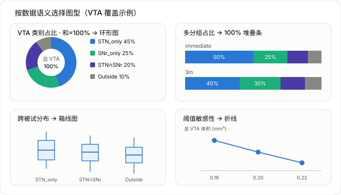

# VTA 计算模块重构计划

> Status: **Phase 1 implemented**. The initial checkpoint commit `ddb6888f0`
> recorded this plan before code changes. Phase 1 keeps existing public entry
> points compatible while extracting shared VTA, coverage, utility, and
> visualization primitives.

## Context（背景与目标）

`my_helper/fiber/` 下与 VTA（Volume of Tissue Activated）计算相关的代码经过多轮迭代后，出现了三个结构性问题，需要重构：

1. **后段计算与项目调用耦合**：真正被 cohort 分析使用的 VTA 生成逻辑并不在 `mh_fiber_ensure_vta` 内核里，而是内联在 1269 行的 STNSNr 编排器中（`ensure_program_efields` → `run_horn_with_retry` → `ea_genvat_horn`），连电导率、阈值、atlas、removeElectrode 等 `vatsettings` 都硬编码在里面。全仓库存在三条各自为政、互相复制的 VTA 生成入口。
2. **VTA 模型未分模块**：两个后段（two-source `ensure_vta`、one-solve `ensure_vta_onesolve`）没有共同接口，靠“调不同函数名”选模型；`mh_fiber_model_name` 只认 `'simbio'`；无法按模型类型分发，加新模型要改每个编排器。
3. **并行度低**：并行只做在被试级，靠 env 变量 + 锁目录 + PID 表 spawn 多个 `matlab -batch` 进程实现，粗粒度且脆弱；被试内部 phase×protocol×side×threshold 完全串行，最贵的 FEM 求解（每个 program×side 独立）没有并行；阈值扫描对同一 e-field 每阈值重读重采样。

**新增要求（本轮）**：
- atlas 指定必须作为项目编排层的一部分注入，而不是固定在内核/分析层。这同时适用于「VTA 灰质限制 atlas」和「分类/分割 atlas」两类。
- 美化输出 figure，并按数据类型选择合适图型——占比类（和=100%，如 VTA 各类别占比）用环形图/饼图，而非普通柱状图。

预期结果：形成自上而下依赖、下层不知上层的五层结构；VTA 生成收敛到唯一入口；模型可插拔；atlas 由项目注入；并行下沉到任务级。

## 当前状态清单（关键文件）

- 刺激规格（已基本项目无关）：`mh_fiber_stimspec_from_table.m`、`mh_fiber_set_stimulation.m`、`mh_fiber_build_stimulation.m`、`mh_fiber_make_stim_label.m`、`mh_fiber_model_name.m`
- VTA 后段内核：`core/stimulation/mh_fiber_ensure_vta.m`（two-source）、`core/stimulation/mh_fiber_ensure_vta_onesolve.m`（334 行，内联复制了 Lead-DBS 的 apply_dbs/calc_gradient/dbs_matrix/sb_solve）
- 编排器（项目耦合严重）：`core/stimulation/mh_fiber_run_stnsnr_vta_coverage.m`（1269 行）、`core/stimulation/mh_fiber_run_stnsnr_target_component_vta_distribution.m`（967 行）、`core/stimulation/mh_fiber_compare_vta_schemes.m`
- 项目脚本：`stnsnr/run_stnsnr_vta_coverage{,_parallel,_worker,_cohort_aggregate}.m`
- 分层违规：`core/stimulation/mh_fiber_build_l2_l5to8_stimulation.m` 是 sub-001 专用预设却放在 core
- 错放的默认：`core/config/mh_fiber_default_config.m:40` `cfg.vta.gmAtlas = 'DISTAL Nano (Ewert 2017)'`

## 已确认的重复定义（去重依据）

| 函数 | 定义处 |
|---|---|
| `run_horn_with_retry` / `is_horn_index_error` / `stable_retry_seed` | 2（两个 STNSNr 编排器各一份） |
| `sample_image_to_grid` / `classify_vta` / `atlas_path` / `verify_atlas_files` | 2 |
| `normalize_contact_table` / `write_json` / `make_dir` / `must_be_folder` | 2 |
| `sanitize_label` / `resolve_repo_dir` | 3 |

## 目标架构（五层）

```
Layer 5  项目编排   stnsnr/、pipelines/sub001/  —— 只知数据 schema、路径、atlas 选择，薄
Layer 4  执行/并行  通用任务调度（parpool 或进程池），替代 env+锁
Layer 3  覆盖分析   通用 e-field→体素网格→region 分类→汇总，atlas-agnostic
Layer 2  VTA 内核   按模型分发的计算引擎（唯一 VTA 生成入口）
Layer 1  刺激规格   stimSpec 构建/校验（已基本就绪）
```

## 目标 1 — 后段计算与项目调用解耦

1. 新增唯一 VTA 生成 façade `core/stimulation/model/mh_vta_compute.m`，签名 `vta = mh_vta_compute(cfg, S, options, request)`，`request` 指定 sides/force/model/输出 space。所有 VTA 生成统一走它。
2. 把 STNSNr 编排器里内联的 `ensure_program_efields`/`generate_component_efield`/`run_horn_with_retry`/`is_horn_index_error`/`stable_retry_seed` 全部收回 Layer 2，删除重复；编排器改为只调 `mh_vta_compute`。
3. 抽出通用覆盖分析引擎 Layer 3（`core/coverage/`）：`build_condition_reference_grid`、`sample_image_to_grid`、区域分类、`category_summary_rows`、`write_ref_nii` 项目无关化。
4. 抽出通用工具 `core/util/`：`sanitize_label`/`resolve_repo_dir`/`make_dir`/`must_be_folder`/`must_be_file`/`write_json` 单份化。
5. 把 `mh_fiber_build_l2_l5to8_stimulation.m` 移到 `pipelines/sub001/`。
6. 新增 `mh_vta_settings.m` 作为 `vatsettings`（0.33/0.14、ethresh、removeElectrode）唯一默认来源。

## 目标 2 — 不同 VTA 计算类型分模块

1. `core/stimulation/model/mh_vta_model_registry.m`：model key → 后端函数 + 能力标志（电压/电流、多电压、输出类型）。`mh_vta_compute` 据此分发；`mh_fiber_model_name` 改为查注册表。
2. `model/backends/`：`mh_vta_backend_simbio_twosource.m`（← ensure_vta）、`mh_vta_backend_simbio_onesolve.m`（← ensure_vta_onesolve 薄壳）；统一契约 `(cfg,S,options,side)->写标准路径`；`missing_vta_files`/`read_vat_volume` 提公共层。
3. `model/fem/`：把 one-solve 的数值内核（apply_dbs/gradient/solve/matrix）从 334 行大文件剥离，便于单测与复用。
4. 加新模型只需新增 backend 文件 + 注册，编排/分析层零改动。

## 目标 3 — 提升并行度

1. 定义原子计算单元 = (subject × program × side) 的 e-field 生成，生成任务清单后用 parpool（parfor/parfeval）在单进程内并行，取代 env+锁+PID 表+单独 aggregate；沿用 seed-target 已验证的「串行 setup + 独立任务」范式。
2. 保留进程隔离作为一种模式：把现有 spawn 逻辑封进统一执行 harness（`executionMode = 'parpool' | 'process'`），两模式共用任务清单与错误汇总。
3. 阈值扫描去冗余：reference grid 每 condition 只建一次；e-field 只重采样到网格一次，之后在内存里对多阈值做 `>=` 比较。
4. 并行参数入 config：`cfg.vta.parallel/parallelWorkers/executionMode`。
5. 风险：`ea_genvat_horn` 依赖 `options.prefs.machine.vatsettings` 全局态，parpool worker 需各自持独立 options 副本；one-solve 复用 headmodel 文件，需保证同 subject/side 的 headmodel 不被并发写。

## atlas 外置化（本轮新增要求，贯穿三个目标）

当前两类 atlas 都写死，均改为由 Layer 5 项目编排注入：

**Role 1 — VTA 灰质限制 atlas**（`cfg.vta.gmAtlas` → `options.atlasset`/`horn_atlasset`/`horn_useatlas`）
- 现状：default_config 写死 'DISTAL Nano'，两编排器覆盖成 'DISTAL Minimal'。
- 改法：作为 VTA 模型配置的一部分由项目显式传入；内核只消费，不内置默认。default_config 可保留一个有文档说明的兜底值，但项目层显式设置。

**Role 2 — 分类/分割 atlas**（`atlasDir` + `atlas_path` + `classify_vta`）
- 现状：路径写死 `Custom_Ewert_Zhang_Middlebrooks0.05`；类别写死 STN_only/SNr_only/STN_SNr/Outside；布局写死 `<dir>/<hemi>/<roi>.nii.gz`。
- 改法（**已确认：通用 N 区域归属划分**）：Layer 3 覆盖引擎接收项目提供的 **region 规格**（一组命名区域，每个含 per-hemisphere 掩膜路径或解析器），引擎把每个区域掩膜重采样到 reference grid，做通用「成员归属划分」分类。STN/SNr 语义变成 STNSNr 项目定义的一个实例。
- region 规格数据契约（草案）：
  ```
  regionSpec.regions(i).name       e.g. 'STN'
  regionSpec.regions(i).maskPaths  struct('L', path, 'R', path)
  regionSpec.categoryScheme        'membership_partition'（默认）
  ```
  N 个区域 → 2^N−1 个非空归属组合 + 'Outside'。N=2 时正好复现现有 {STN_only,SNr_only,STN_SNr,Outside}，输出向后兼容。
- 类别命名规则：单区域组合 = `<region>_only`；多区域交集 = 区域名按注入顺序用 `_` 连接（如 `STN_SNr`）；无归属 = `Outside`。`classify_vta`（现写死 4 类）与 `category_summary_rows` 的 `names`/`categoryImg` 整数编码改为按 region 规格动态生成，`write_condition_masks` 的 category NIfTI 编码值与图例随之动态化。
- STNSNr 编排器保留一个 `stnsnr_region_spec`（STN+SNr，沿用 `Custom_Ewert_Zhang_Middlebrooks0.05` 的 `<hemi>/<roi>.nii.gz` 布局作为该项目自己的解析约定），验证其输出与重构前逐数值一致。

## 目标 4 — 图表美化 + 按数据类型选择图型（本轮新增）

现状：两个编排器里的绘图各写一份，只用了 `bar` / `boxchart` / `plot` 三种，且把「本应是占比合成」的类别体积也画成普通柱状图，风格分散、无统一配色/字体。

**核心原则：图型由数据语义决定，占比合成（和=100%）用环形图/饼图。**

抽出统一可视化子模块 `core/viz/`（Layer 3 的一部分，项目无关），提供：
- `mh_viz_apply_style(ax)`：统一字体、字号、留白、网格、白底、去 chartjunk。
- `mh_viz_palette(names)`：按区域/类别名解析配色，复用 `cfg.figure.colors`（NAc `#82D143`、ALIC `#3070B7` 等），并为 N 区域类别扩展稳定色板。
- 按语义分型的绘图函数：
  - `mh_viz_composition_donut(names, values)`：**部分-整体、和=100%** → 环形图，扇区标百分比，中心孔显示总量/标签，图例按类别。用于 VTA 各类别占比（现 `write_condition_figure`/`write_component_figure` 的 bar 改为此）。
  - `mh_viz_stacked_share_bar(...)`：多分组的 100% 堆叠占比条（现 cohort/target-component 的 `stacked_bar` 改为真正 100% 堆叠并标百分比）。
  - `mh_viz_box(...)`：跨被试**分布** → 保留 boxchart，套统一风格（现 `*_boxplot_*`）。
  - `mh_viz_trend_line(...)`：连续变量**趋势** → 保留 line（现 `*_threshold_sensitivity`）。
- 因分类已泛化为 N 区域，环形图/堆叠条须支持任意 N 个类别、动态配色与图例；类别名与颜色与 region 规格一致。

图型选型速查：

| 数据语义 | 现状 | 目标图型 |
|---|---|---|
| VTA 各类别占比（和=100%） | 普通柱状图 | 环形图/饼图，扇区标百分比 |
| 多分组占比 | 普通/伪堆叠 bar | 真正 100% 堆叠条并标百分比 |
| 跨被试体积分布 | boxchart | 箱线图（保留，统一风格） |
| 阈值-体积趋势 | line | 折线图（保留，统一风格） |

图型选型样例（以 STN/SNr 覆盖为例，仅示意目标图型，非真实数据）：



编排器的 `write_condition_figure`/`write_component_figure`/`write_cohort_figures`/`write_summary_figures` 改为组装「图规格（数据 + 语义类型）」后交给 `core/viz/`，不再各自内联 `figure/bar/exportgraphics`。

## 建议执行顺序（每步可独立验证、结果不变）

1. 抽公共工具 + 覆盖分析引擎去重（纯搬移，用现有 cohort 输出做数值回归）。
2. 建 VTA 内核 façade + 模型后端/注册表 + atlas 作为参数注入（三处生成入口收敛，对 sub-001 与 STNSNr 各跑一次逐体素比对 binary/e-field 一致）。
3. 移预设、集中 vatsettings、修分层、externalize gmAtlas。
4. 并行 harness + 阈值扫描去冗余（先做 IO 去冗余结果不变，再切并行，用小样本比对与全 cohort 计时验证）。
5. 统一 `core/viz/` 子模块 + 按数据语义换图型（占比→环形/100% 堆叠，分布→boxplot，趋势→line），编排器改为组装图规格。

## 验证

- **数值回归**：重构前后对同一 subject/label 跑 VTA，逐体素比对 `*_binary_*.nii` 与 `*_efield_*.nii`（应完全一致）；对 STNSNr cohort 比对 `cohort_vta_coverage_long.csv` 数值。
- **atlas 注入验证**：用非 STN/SNr 的 region 规格（如临时造一个单区域 atlas）跑覆盖引擎，确认分类类别按注入生成而非写死。
- **并行验证**：小样本（1–2 subject）比对 parpool 模式与串行模式输出一致；全 cohort 记录并行前后墙钟时间。
- **图表验证**：目视检查 cohort/per-subject figures——占比类图为环形/100% 堆叠且扇区标百分比、和为 100%；分布类为 boxplot；趋势类为 line；配色/字体全项目统一。底层数值表（CSV）不受绘图改动影响。
- 运行入口：`matlab -batch "cd('/Users/mojackhu/Github/leaddbs'); addpath(genpath(pwd)); run('.../stnsnr/run_stnsnr_vta_coverage.m')"`。

## Phase 1 Implementation Scope

Phase 1 implements the smallest behavior-preserving cut through the plan:

- Add `core/util/` helpers for labels, repository resolution, directory/file
  validation, JSON writing, and VTA output introspection.
- Add `core/coverage/` helpers for reference-grid construction, image sampling,
  generic membership-partition region classification, category summaries, and
  reference NIfTI writing.
- Add `core/stimulation/model/` with `mh_vta_compute`, `mh_vta_settings`, and a
  model registry. Existing `mh_fiber_ensure_vta*` functions become compatibility
  wrappers around the facade.
- Add `core/stimulation/model/backends/` and `core/stimulation/model/fem/` so
  the SimBio two-source backend, SimBio one-solve backend, and one-solve FEM
  primitives have separate responsibilities.
- Add `core/viz/` helpers for shared style, stable palettes, donut composition
  plots, 100% stacked share bars, box plots, and threshold trend plots.
- Update STNSNr coverage code to receive an explicit region specification for
  classification atlas paths. STN/SNr output category names remain compatible:
  `STN_only`, `SNr_only`, `STN_SNr`, and `Outside`.

Deferred beyond Phase 1:

- Replacing process-level worker launch with a full task-level parpool harness.
- Full cohort-scale numerical regression, because it requires the external
  `/Volumes/VAL/STNSNr` subject data and long FEM generation runtime.

Phase 1 validation completed:

- `git diff --check`
- MATLAB smoke test for `mh_vta_model_registry`, `mh_fiber_model_name`, generic
  membership-partition classification, category summary rows, and category voxel
  accounting.
- MATLAB smoke test for `mh_viz_composition_donut` and
  `mh_viz_stacked_share_bar` PNG export in `-batch` mode.

## Phase 2A Implementation Scope

Status: **implemented**.

Phase 2A targets the threshold-scanning redundancy from Goal 3 without changing
VTA generation semantics:

- Add `mh_coverage_sample_scalar_to_grid(sourcePath, ref)` to resample an
  e-field NIfTI onto the condition/component reference grid once as a numeric
  array.
- In STNSNr cohort coverage and target-component coverage, precompute one
  sampled e-field array per program/component e-field before the threshold loop.
- For each threshold, derive `hitCount` from the in-memory sampled arrays with
  `sampledEfield >= thresholdVPerM` instead of reloading and resampling the same
  NIfTI for every threshold.
- Preserve existing nearest-neighbor sampling, outside-grid non-hit behavior,
  output CSV fields, output mask names, and category calculations.
- Keep `mh_coverage_sample_threshold_to_grid` for compatibility and tests that
  need direct one-threshold sampling.

Phase 2A validation target:

- MATLAB smoke test proving `mh_coverage_sample_scalar_to_grid(path, ref) >= t`
  matches `mh_coverage_sample_threshold_to_grid(path, ref, t)` on a synthetic
  NIfTI for multiple thresholds.
- MATLAB smoke test proving multi-threshold in-memory `hitCount` union/overlap
  logic matches repeated threshold sampling for two synthetic e-fields.
- `git diff --check`.

Phase 2A validation completed:

- `git diff --check`
- MATLAB synthetic NIfTI smoke test comparing scalar sampling plus in-memory
  thresholding against repeated direct threshold sampling, including `t = 0`
  outside-grid behavior.
- MATLAB synthetic two-e-field smoke test comparing in-memory union/overlap
  `hitCount` logic against repeated threshold sampling.
- `checkcode` on the new scalar sampler and both STNSNr analyzers; only existing
  dynamic-growth performance warnings remain in the large analyzers.

## Phase 2B Implementation Scope

Status: **implemented**.

Phase 2B starts the execution-harness migration without changing runtime
parallelism yet:

- Add VTA execution defaults to `mh_fiber_default_config`:
  `cfg.vta.parallel`, `cfg.vta.parallelWorkers`, and `cfg.vta.executionMode`.
- Add shared task primitives under `core/stimulation/model/`:
  - `mh_vta_make_compute_task(cfg, stimFolders, sideCode, request)` builds one
    atomic `(stimLabel x side)` task with expected standard VTA/e-field paths.
  - `mh_vta_run_compute_task(cfg, S, options, task)` executes that task by
    calling `mh_vta_compute` with `request.sides = {sideCode}` and returns
    standardized output paths/status metadata.
- Route STNSNr program e-field generation through those primitives so each
  program side is represented as a task before execution. Phase 2B still runs
  tasks sequentially; it is the behavior-preserving bridge to later
  `executionMode = 'parpool' | 'process'`.

Phase 2B validation target:

- MATLAB smoke test for VTA execution defaults and task construction.
- MATLAB smoke test with a stub `mh_vta_compute` proving
  `mh_vta_run_compute_task` passes only the task side and returns the expected
  MNI paths.
- `git diff --check`.

Phase 2B validation completed:

- `git diff --check`
- MATLAB smoke test for `cfg.vta.parallel`, `cfg.vta.parallelWorkers`, and
  `cfg.vta.executionMode` defaults plus `mh_vta_make_compute_task` path/request
  construction.
- MATLAB smoke test with a temporary `mh_vta_compute` stub proving
  `mh_vta_run_compute_task` passes `request.sides = {'R'}` for a right-side
  task and returns standard MNI/native output path metadata.
- `checkcode` on the new task helpers, default config, and both STNSNr analyzers;
  only existing dynamic-growth performance warnings remain in the large
  analyzers.

## Phase 2C Implementation Scope

Status: **implemented**.

Phase 2C adds the first reusable batch execution helper for VTA tasks:

- Add `mh_vta_execution_config(cfg, taskCount)` to resolve
  `cfg.vta.executionMode`, `cfg.vta.parallel`, and `cfg.vta.parallelWorkers`,
  with safe fallback to sequential execution when the Parallel Computing Toolbox
  is unavailable.
- Add `mh_vta_run_compute_tasks(cfg, S, options, tasks)` to run an array of
  atomic VTA compute tasks through either sequential execution or `parfor`.
- Update STNSNr program-side generation to call the batch helper while keeping
  default execution mode sequential. This preserves current behavior and creates
  one shared call site for future task-level parpool/process scheduling.

Phase 2C validation target:

- MATLAB smoke test for `mh_vta_execution_config` sequential defaults and
  explicit parpool fallback behavior when parallel execution is unavailable.
- MATLAB smoke test with a stub `mh_vta_compute` proving
  `mh_vta_run_compute_tasks` executes two side tasks and returns standardized
  result structs.
- `git diff --check`.

Phase 2C validation completed:

- `git diff --check`
- MATLAB smoke test for `mh_vta_execution_config` defaults, explicit sequential
  behavior, and invalid-mode rejection.
- MATLAB smoke test with a temporary `mh_vta_compute` stub proving
  `mh_vta_run_compute_tasks` executes right and left side tasks and preserves
  standardized result ordering/path metadata.
- `checkcode` passes cleanly for `mh_vta_execution_config` and
  `mh_vta_run_compute_tasks`; the large STNSNr analyzer still has only existing
  dynamic-growth performance warnings.

## Phase 2D Implementation Scope

Status: **implemented**.

Phase 2D encapsulates the current process-isolated worker launcher behind a
reusable harness while preserving the existing subject-level worker behavior:

- Add `mh_vta_launch_process_workers(subjectIds, workerScript, logDir, ...)`
  under `core/stimulation/model/`.
- The helper owns round-robin subject chunking, environment variable assembly,
  Conda-aware MATLAB batch command construction, dry-run mode, PID capture, and
  job table construction.
- Update `stnsnr/run_stnsnr_vta_coverage_parallel.m` to build project-specific
  inputs and delegate process launching to the helper.
- Keep the existing worker script and cohort aggregation flow unchanged.

Phase 2D intentionally does **not** complete task-level process execution for
program-by-side VTA tasks. It is the first process-mode harness extraction; the
remaining step is to connect the program-side task list from Phase 2B/2C to a
process executor and then validate process/parpool/sequential equivalence on a
small subject subset.

Phase 2D validation target:

- MATLAB dry-run smoke test for `mh_vta_launch_process_workers`, verifying
  subject chunking, environment assignment, command construction, log paths, and
  no real worker launch.
- MATLAB dry-run smoke test for `run_stnsnr_vta_coverage_parallel.m` with a
  temporary workbook and `STNSNR_VTA_DRY_RUN=true`.
- `git diff --check`.

Phase 2D validation completed:

- `git diff --check`
- MATLAB dry-run smoke test for `mh_vta_launch_process_workers`, verifying
  subject chunking, environment assignment, command construction, log paths,
  dry-run status, and semicolon-separated job-table subject lists.
- MATLAB dry-run smoke test for `run_stnsnr_vta_coverage_parallel.m` with a
  temporary workbook/output directory and `STNSNR_VTA_DRY_RUN=true`, verifying
  the project launcher delegates to the shared process harness and preserves
  project-specific environment overrides.

## Phase 2E Implementation Scope

Status: **implemented**.

Phase 2E connects the program-side task list from Phase 2B/2C to process-mode
execution while keeping sequential execution as the default:

- Extend the task batch helper so `cfg.vta.executionMode = 'process'` is a
  supported task execution mode instead of only a subject-level launcher mode.
- Add process-mode configuration defaults for the MATLAB executable, Conda
  environment, dry-run planning, task work directory, polling interval, and
  timeout.
- Add a task-worker entry point that receives serialized `(program x side)`
  task payloads, reconstructs the shared VTA inputs, and calls
  `mh_vta_run_compute_task` in an isolated MATLAB process.
- Keep existing STNSNr subject-level process workers compatible; they remain a
  project launcher around whole-subject batches, while Phase 2E handles
  intra-subject program-side tasks.
- Validate with dry-run and stubbed compute tests before any real FEM run.

Phase 2E validation target:

- MATLAB smoke test proving sequential and process-mode dry-run planning create
  equivalent task ordering and expected output metadata for two side tasks.
- MATLAB stub-worker smoke test proving a serialized task payload can be loaded
  and executed by the process task-worker entry point without requiring real FEM
  data.
- `git diff --check`.

Phase 2E validation completed:

- `git diff --check`
- `checkcode` passes cleanly for the new process-mode helpers and touched VTA
  execution/config files.
- MATLAB smoke test proving `cfg.vta.executionMode = 'process'` plus
  `cfg.vta.processDryRun = true` serializes two side tasks, writes worker
  manifests, and preserves task ordering/result metadata without launching
  workers.
- MATLAB stub-worker smoke test proving `mh_vta_compute_task_worker` can load a
  serialized payload and execute `mh_vta_run_compute_task` with a stubbed
  `mh_vta_compute`.
- MATLAB dry-run regression for `mh_vta_launch_process_workers`, confirming the
  subject-level STNSNr launcher still preserves subject chunking, Conda-aware
  command construction, and environment assignment.

Deferred validation:

- Real FEM process-mode execution on a 1-2 subject subset.
- Numerical equivalence among sequential, parpool, and process modes for
  program-side e-field outputs.
- Full cohort timing and numerical regression against
  `cohort_vta_coverage_long.csv`.

## Phase 2F Implementation Scope

Status: **implemented**.

Phase 2F wires the execution harness into the STNSNr project entry points so
the new modes are selectable during real cohort runs:

- Add `VtaExecutionMode`, `VtaParallelWorkers`, `VtaMatlabExe`, `VtaCondaEnv`,
  `VtaProcessWorkDir`, `VtaProcessPollSeconds`, and
  `VtaProcessTimeoutSeconds` parameters to
  `mh_fiber_run_stnsnr_vta_coverage`.
- Pass those options into each per-program VTA cfg before
  `mh_vta_run_compute_tasks` is called.
- Add matching environment variable overrides to
  `stnsnr/run_stnsnr_vta_coverage_worker.m` so subject-level process workers can
  choose intra-subject `sequential`, `parpool`, or `process` execution without
  code edits.
- Add the same environment variable overrides to
  `stnsnr/run_stnsnr_vta_coverage.m` for non-parallel cohort runs.
- Propagate those environment variables from
  `stnsnr/run_stnsnr_vta_coverage_parallel.m` into spawned subject workers.
- Keep subject-level job CSV files readable by MATLAB `readtable` by writing
  full shell commands to per-worker command files and storing only command file
  paths in the job table.
- Keep all defaults behavior-preserving: execution remains sequential with one
  worker unless explicitly overridden.

Phase 2F validation target:

- MATLAB parser/config smoke test proving the STNSNr coverage entry point
  writes the requested execution mode into the per-program cfg before task
  dispatch.
- MATLAB dry-run regression for `run_stnsnr_vta_coverage_parallel.m`, verifying
  worker environment propagation for VTA execution options.
- MATLAB dry-run regression proving `parallel_jobs_latest.csv` remains a
  seven-column comma-delimited table when read with MATLAB `readtable`.
- `git diff --check` and focused `checkcode`.

Phase 2F validation completed:

- `git diff --check`
- Focused `checkcode` passes cleanly for `mh_vta_apply_execution_options`,
  `mh_vta_launch_process_workers`, `mh_fiber_env_double`, and the STNSNr worker
  and parallel launcher scripts.
- MATLAB smoke test for `mh_vta_apply_execution_options`, verifying execution
  mode normalization, worker count, process MATLAB/Conda settings, poll/timeout
  settings, and invalid-mode rejection.
- MATLAB dry-run regression for `run_stnsnr_vta_coverage_parallel.m`, verifying
  execution environment propagation into per-worker command files and confirming
  `parallel_jobs_latest.csv` remains a seven-column comma-delimited job table.
- MATLAB dry-run regression for `mh_vta_launch_process_workers`, verifying
  command-file generation and semicolon-separated subject env chunks.
- Static verification that both non-parallel and worker STNSNr scripts pass the
  VTA execution parameters into `mh_fiber_run_stnsnr_vta_coverage`.

Deferred validation:

- Real FEM process-mode execution on a 1-2 subject subset.
- Numerical equivalence among sequential, parpool, and process modes for
  program-side e-field outputs.
- Full cohort timing and numerical regression against
  `cohort_vta_coverage_long.csv`.

## Phase 2G Validation Audit

Status: **partial validation completed**.

Phase 2G checked what can be verified safely against the available real STNSNr
outputs without overwriting non-Git files under `/Volumes/VAL`:

- Confirmed the real STNSNr subject root exists at
  `/Volumes/VAL/STNSNr/derivatives/leaddbs`.
- Confirmed the real stimulation workbook exists at
  `/Users/mojackhu/Research/STNSNr/summary/cohort/subj/followup_stimulation.xlsx`.
- Confirmed existing cohort outputs exist under `/Volumes/VAL/STNSNr/summary/vta`.
- Ran `mh_fiber_run_stnsnr_vta_coverage` with `CohortOnly = true` into a
  temporary `/tmp/stnsnr_vta_cohort_reg_*` output directory.
- Compared the regenerated temporary `cohort_vta_coverage_long.csv` against the
  existing `/Volumes/VAL/STNSNr/summary/vta/cohort_vta_coverage_long.csv`.
  The tables matched exactly for row count, column count, variable names, key
  columns, and numeric coverage columns: 1536 rows x 25 columns.

Real subject reruns remain deferred because even with `ForceVta = false`, the
STNSNr subject pipeline rewrites subject-level CSV/manifest files under
`/Volumes/VAL/STNSNr/derivatives/leaddbs/<subject>/connectomics/stnsnr_vta_coverage`.
Those files are outside Git, so they should not be overwritten without an
explicit validation run decision and backup/trash policy.

Still deferred:

- Real FEM process-mode execution on a copied or explicitly approved 1-2 subject
  validation subset.
- Numerical equivalence among sequential, parpool, and process modes for
  program-side e-field outputs.
- Full cohort timing comparison after an approved real execution run.

## Phase 2H Implementation Scope

Status: **implemented**.

Phase 2H applies the same execution-harness controls to target-component
counterfactual VTA generation:

- Add the `VtaExecutionMode`, `VtaParallelWorkers`, `VtaMatlabExe`,
  `VtaCondaEnv`, `VtaProcessWorkDir`, `VtaProcessPollSeconds`, and
  `VtaProcessTimeoutSeconds` parameters to
  `mh_fiber_run_stnsnr_target_component_vta_distribution`.
- Apply those options to each generated counterfactual component cfg before VTA
  task execution.
- Replace the direct `mh_vta_run_compute_task` call with
  `mh_vta_run_compute_tasks` so target-component generation uses the same
  sequential/parpool/process execution harness as cohort coverage.
- Add matching environment variable overrides to
  `stnsnr/run_stnsnr_target_component_vta_distribution.m`.
- Keep default behavior unchanged: sequential execution with one worker.

Phase 2H validation target:

- `git diff --check`
- Focused `checkcode` for the target-component analyzer and runner.
- Static verification that target-component counterfactual generation calls
  `mh_vta_run_compute_tasks` and that the project runner passes VTA execution
  parameters into the core analyzer.

Phase 2H validation completed:

- `git diff --check`
- Focused `checkcode`: the target-component runner is clean; the large
  target-component analyzer still has only its existing dynamic-growth
  performance warning.
- Static verification that the target-component analyzer applies
  `mh_vta_apply_execution_options`, calls `mh_vta_run_compute_tasks`, and records
  VTA execution options in its manifest.
- Static verification that `run_stnsnr_target_component_vta_distribution.m`
  reads and passes the shared `STNSNR_VTA_*` execution environment variables.
- MATLAB stub smoke test proving the single-task `mh_vta_run_compute_tasks`
  path returns the same result metadata expected by target-component generation.

## Phase 2I Implementation Scope

Status: **implemented**.

Phase 2I removes the duplicated STN/SNr region-spec helper from the two STNSNr
analyzers:

- Add `mh_fiber_stnsnr_region_spec(atlasDir)` as the single project-level
  region-spec constructor for the injected STN/SNr classification atlas.
- Replace local `stnsnr_region_spec` functions in cohort coverage and
  target-component coverage with calls to the shared helper.
- Keep the region names, project label, description, and hemisphere atlas layout
  unchanged.

Phase 2I validation target:

- `git diff --check`
- Focused `checkcode` for the new helper and both touched analyzers.
- MATLAB smoke test proving `mh_fiber_stnsnr_region_spec` returns the expected
  project metadata, region names, category scheme, and per-hemisphere mask path
  fields.

Phase 2I validation completed:

- `git diff --check`
- `checkcode` passes cleanly for `mh_fiber_stnsnr_region_spec`; the two large
  analyzers still have only their existing dynamic-growth performance warnings.
- MATLAB smoke test proving the shared helper returns project `STNSNr`,
  `membership_partition`, STN/SNr region names, and L/R mask path fields.
- Static search confirms both STNSNr analyzers now call
  `mh_fiber_stnsnr_region_spec` and no local `stnsnr_region_spec` functions
  remain.

## Phase 2J Implementation Scope

Status: **implemented**.

Phase 2J removes duplicated STN/SNr contact-table normalization from the cohort
coverage and target-component analyzers:

- Add `mh_fiber_stnsnr_normalize_contact_table(tableIn)` as the shared
  normalizer for old workbook-style headers and normalized per-subject contact
  QC CSV headers.
- Preserve accepted legacy column names, normalized snake_case names, string
  columns, logical parsing for `contact_side_rule_ok`, and numeric conversion
  for contact/parameter columns.
- Replace local `normalize_contact_table` functions in both analyzers with
  calls to the shared helper.
- Keep analyzer-local `force_string_vars` helpers that are still used for
  analyzer-specific output tables.

Phase 2J validation target:

- `git diff --check`
- Focused `checkcode` for the new helper and both touched analyzers.
- MATLAB synthetic smoke test covering old header renaming, string conversion,
  numeric conversion, and logical parsing.
- Non-destructive cohort-only aggregation regression into `/tmp`, comparing the
  regenerated cohort contact QC and coverage tables against existing real
  outputs.

Phase 2J validation completed:

- `git diff --check`
- `checkcode` passes cleanly for `mh_fiber_stnsnr_normalize_contact_table`; the
  two large analyzers still have only their existing dynamic-growth performance
  warnings.
- MATLAB synthetic smoke test covering legacy header renaming, string
  conversion, numeric conversion, valid logical parsing, and invalid logical
  rejection.
- Static search confirms both analyzers call
  `mh_fiber_stnsnr_normalize_contact_table` and no local
  `normalize_contact_table` functions remain.
- Non-destructive cohort-only aggregation regression into
  `/tmp/stnsnr_vta_contact_reg_*`; regenerated coverage table matched existing
  output shape at 1536 x 25, and regenerated contact QC matched existing output
  shape, key columns, logical column, and numeric columns at 194 x 20.

## Phase 2K Implementation Scope

Status: **implemented**.

Phase 2K externalizes the VTA gray-matter restriction atlas used by the STNSNr
project analyzers:

- Add `VtaGmAtlas` to `mh_fiber_run_stnsnr_vta_coverage` and
  `mh_fiber_run_stnsnr_target_component_vta_distribution`.
- Replace analyzer-internal hardcoded `DISTAL Minimal (Ewert 2017)` assignments
  with `opts.VtaGmAtlas` when populating `cfg.vta.gmAtlas` and
  `request.gmAtlas`.
- Add `STNSNR_VTA_GM_ATLAS` overrides to the STNSNr project scripts and the
  subject-level parallel launcher environment propagation.
- Keep default behavior unchanged by defaulting to
  `DISTAL Minimal (Ewert 2017)`.

Phase 2K validation target:

- `git diff --check`
- Focused `checkcode` for touched STNSNr scripts/analyzers.
- Static search confirming STNSNr analyzers no longer assign hardcoded
  `DISTAL Minimal (Ewert 2017)` directly.
- MATLAB dry-run regression for the parallel launcher proving
  `STNSNR_VTA_GM_ATLAS` is forwarded to worker command files.

Phase 2K validation completed:

- `git diff --check`
- Focused `checkcode`: STNSNr project scripts are clean; the two large analyzers
  still have only their existing dynamic-growth performance warnings.
- Static search confirms STNSNr analyzers no longer assign hardcoded
  `DISTAL Minimal (Ewert 2017)` directly to `cfg.vta.gmAtlas` or
  `request.gmAtlas`; they use `opts.VtaGmAtlas`.
- MATLAB dry-run regression for `run_stnsnr_vta_coverage_parallel.m`, proving
  `STNSNR_VTA_GM_ATLAS` is forwarded into worker command files.

## Phase 2L Implementation Scope

Status: **implemented**.

Phase 2L makes the cohort aggregation script consistent with the parallel
launcher and worker scripts:

- Read `STNSNR_VTA_SUBJECT_ROOT`, `STNSNR_VTA_WORKBOOK`,
  `STNSNR_VTA_COHORT_OUTPUT_DIR`, and `STNSNR_VTA_GM_ATLAS` in
  `stnsnr/run_stnsnr_vta_coverage_cohort_aggregate.m`.
- Pass those values into `mh_fiber_run_stnsnr_vta_coverage` with
  `CohortOnly = true`.
- Keep default behavior unchanged when the environment variables are unset.

Phase 2L validation target:

- `git diff --check`
- Focused `checkcode` for the aggregate script.
- Non-destructive aggregate smoke/regression into `/tmp`, verifying custom
  output directory use and cohort CSV shape against existing outputs.

Phase 2L validation completed:

- `git diff --check`
- `checkcode` passes cleanly for `run_stnsnr_vta_coverage_cohort_aggregate.m`.
- Non-destructive aggregate script regression with
  `STNSNR_VTA_COHORT_OUTPUT_DIR=/tmp/stnsnr_vta_aggregate_env_*`, verifying the
  script writes outputs to the env-selected directory, produces
  `cohort_vta_coverage_long.csv` at 1536 x 25, and records the env-selected
  `vta_gm_atlas` in `cohort_vta_generation_manifest.json`.

## Phase 2M Implementation Scope

Status: **implemented**.

Phase 2M removes the remaining local stimulation-label sanitizer while
preserving existing label semantics:

- Extend `mh_util_sanitize_label` with optional `PreservePlus` and `ErrorId`
  arguments. Defaults must preserve current utility behavior, including
  converting `+` to `plus`.
- Update `mh_fiber_set_stimulation` to call `mh_util_sanitize_label` with
  `PreservePlus = true`, preserving its previous explicit-label behavior.
- Preserve the previous `mh_fiber_set_stimulation:InvalidLabel` error for labels
  that sanitize to an empty string.

Phase 2M validation target:

- `git diff --check`
- Focused `checkcode` for the utility and `mh_fiber_set_stimulation`.
- MATLAB smoke test proving default utility behavior is unchanged,
  `PreservePlus` keeps `+`, explicit stimulation labels keep `+`, and empty
  explicit labels still raise `mh_fiber_set_stimulation:InvalidLabel`.

Phase 2M validation completed:

- `git diff --check`
- `checkcode` passes cleanly for `mh_util_sanitize_label` and
  `mh_fiber_set_stimulation`.
- MATLAB smoke test proving default `mh_util_sanitize_label('STN+SNr')` remains
  `STNplusSNr`, `PreservePlus = true` returns `STN+SNr`, utility `ErrorId`
  rejects empty sanitized labels, explicit stimulation labels preserve `+`, and
  empty explicit stimulation labels still raise
  `mh_fiber_set_stimulation:InvalidLabel`.
- Static search confirms `mh_fiber_set_stimulation` now calls
  `mh_util_sanitize_label` and no local `sanitize_label` function remains.

## Phase 2N Implementation Scope

Status: **implemented**.

Phase 2N unifies Horn invocation retry behavior across VTA backends:

- Route the SimBio one-solve backend's headmodel-preparation
  `ea_genvat_horn` call through `mh_vta_run_horn_with_retry`.
- Generalize the retry helper wording from "expected e-field" to "expected
  output" because the one-solve backend treats the headmodel file as the
  expected post-write artifact.
- Keep the two-source backend behavior unchanged.

Phase 2N validation target:

- `git diff --check`
- Focused `checkcode` for `mh_vta_run_horn_with_retry` and
  `mh_vta_backend_simbio_onesolve`.
- MATLAB synthetic smoke test with a temporary `ea_genvat_horn` stub proving the
  retry helper returns successfully when the expected output file exists after a
  Horn error.

Phase 2N validation completed:

- `git diff --check`
- `checkcode` passes cleanly for `mh_vta_run_horn_with_retry` and
  `mh_vta_backend_simbio_onesolve`.
- MATLAB synthetic smoke test with a temporary `ea_genvat_horn` stub verifies
  that `mh_vta_run_horn_with_retry` returns successfully when the expected
  output file exists after a Horn error. The smoke test runs from the temporary
  stub directory so MATLAB resolves the stub instead of the repository-root
  `ea_genvat_horn.m`.

## Phase 2O Implementation Scope

Status: **implemented**.

Phase 2O removes the remaining duplicated VTA task-assembly sequence from the
two STN/SNr analyzers while preserving project-specific stimulation semantics:

- Add `mh_vta_run_stim_spec_tasks` as a shared Layer 2 helper that consumes a
  prepared `cfg`, a Layer 1 `stimSpec`, a side list, and request options.
- The helper applies the stimulation spec, builds Lead-DBS stimulation inputs,
  constructs one atomic task per side, and dispatches those tasks through
  `mh_vta_run_compute_tasks`.
- Update STN/SNr cohort coverage and target-component coverage so each
  analyzer still owns table-to-`stimSpec` conversion, while task request
  construction and execution live in the VTA model layer.
- Keep default execution, output paths, request fields, GM atlas injection, and
  task result metadata unchanged.

Phase 2O validation target:

- `git diff --check`
- Focused `checkcode` for `mh_vta_run_stim_spec_tasks` and both touched STN/SNr
  analyzers.
- MATLAB synthetic smoke test with temporary stubs proving the helper builds
  ordered side tasks and forwards request options without requiring real FEM
  data.
- Static verification that both STN/SNr analyzers call
  `mh_vta_run_stim_spec_tasks` and no longer call
  `mh_vta_make_compute_task` directly.

Phase 2O validation completed:

- `git diff --check`
- `checkcode` passes cleanly for `mh_vta_run_stim_spec_tasks`; the two large
  STN/SNr analyzers still report only their existing dynamic-growth warnings.
- MATLAB synthetic smoke test with temporary stubs verifies that
  `mh_vta_run_stim_spec_tasks` applies the stimulation spec, builds ordered R/L
  side tasks, forwards output-space, threshold, GM atlas, atlas-use, electrode
  removal, force, and model request options, and dispatches through
  `mh_vta_run_compute_tasks` without real FEM data.
- Static search confirms both STN/SNr analyzers call
  `mh_vta_run_stim_spec_tasks` and no longer call
  `mh_vta_make_compute_task` directly.

## Phase 2P Implementation Scope

Status: **implemented**.

Phase 2P tightens the shared utility boundary for the VTA-facing default
configuration:

- Replace `mh_fiber_default_config`'s local `resolve_repo_dir` helper with the
  shared `mh_util_resolve_repo_dir`.
- Keep subject-dir validation, fallback path behavior, and generated `cfg`
  fields unchanged.
- Leave DWI/ROI-local `resolve_repo_dir` helpers out of scope for this VTA
  cleanup because those scripts belong to separate non-VTA workflows.

Phase 2P validation target:

- `git diff --check`
- Focused `checkcode` for `mh_fiber_default_config` and
  `mh_util_resolve_repo_dir`.
- MATLAB smoke test using a temporary subject directory proving
  `mh_fiber_default_config` resolves `cfg.repoDir` to the repository root and
  keeps standard VTA defaults intact.
- Static verification that `mh_fiber_default_config` calls
  `mh_util_resolve_repo_dir` and no longer defines a local `resolve_repo_dir`.

Phase 2P validation completed:

- `git diff --check`
- `checkcode` passes cleanly for `mh_fiber_default_config` and
  `mh_util_resolve_repo_dir`.
- MATLAB smoke test with a temporary `sub-smoke` subject directory verifies that
  `mh_fiber_default_config` resolves `cfg.repoDir` to
  `/Users/mojackhu/Github/leaddbs` and preserves standard VTA defaults,
  including `modelKey = simbio`, `executionMode = sequential`, and
  `gmAtlas = DISTAL Nano (Ewert 2017)`.
- Static search confirms `mh_fiber_default_config` calls
  `mh_util_resolve_repo_dir` and no longer defines a local `resolve_repo_dir`.

## Phase 2Q Implementation Scope

Status: **implemented**.

Phase 2Q removes the duplicated STN/SNr table-to-stimulation-spec conversion
from the two STN/SNr analyzers:

- Add `mh_fiber_stnsnr_stimspec_from_table(rows, label)` as a shared
  project-level Layer 1 helper.
- Support both workbook-style columns (`Side`, `LeadContact`, `Voltage`,
  `PulseWidth`, `Frequency`) and normalized columns (`side`, `lead_contact`,
  `voltage`, `pulse_width`, `frequency`).
- Delegate the final source construction to the generic
  `mh_fiber_stimspec_from_table` helper so source defaults remain centralized.
- Update STN/SNr cohort coverage and target-component coverage to call the
  shared helper and remove their local `rows_to_stim_spec` and `empty_source`
  functions.

Phase 2Q validation target:

- `git diff --check`
- Focused `checkcode` for `mh_fiber_stnsnr_stimspec_from_table` and both
  touched STN/SNr analyzers.
- MATLAB synthetic smoke test proving workbook-style and normalized STN/SNr
  tables produce identical stimulation specs for side, contact, voltage, pulse
  width, frequency, unit, cathode, anode, model, and space.
- Static verification that no local `rows_to_stim_spec` or `empty_source`
  functions remain in the STN/SNr analyzers.

Phase 2Q validation completed:

- `git diff --check`
- `checkcode` passes cleanly for `mh_fiber_stnsnr_stimspec_from_table` and
  `mh_fiber_stimspec_from_table`; the two large STN/SNr analyzers still report
  only their existing dynamic-growth warnings.
- MATLAB synthetic smoke test proves workbook-style and normalized STN/SNr
  tables produce matching source fields for side, contact, voltage, pulse width,
  frequency, unit, cathode, and anode while preserving requested labels, model,
  and space.
- Static search confirms no local `rows_to_stim_spec` or `empty_source`
  functions remain in the STN/SNr analyzers.

## Phase 2R Implementation Scope

Status: **implemented**.

Phase 2R removes duplicated standard coverage-mask writing from the two STN/SNr
analyzers:

- Add `mh_coverage_write_standard_masks` under `core/coverage`.
- The helper builds the standard VTA, category, and program-overlap mask paths
  from an output directory and base label, preserves the existing suffixes, and
  writes each NIfTI only when forced or missing.
- Update STN/SNr cohort coverage and target-component coverage so they keep
  project-specific base-label construction and description text, but delegate
  path construction and NIfTI writing to the shared coverage helper.
- Keep output filenames, force/reuse behavior, datatypes, and descriptions
  unchanged.

Phase 2R validation target:

- `git diff --check`
- Focused `checkcode` for `mh_coverage_write_standard_masks` and both touched
  STN/SNr analyzers.
- MATLAB synthetic smoke test with a temporary `mh_coverage_write_ref_nii` stub
  proving the helper writes the three standard paths when forced and reuses
  existing paths when not forced.
- Static verification that the STN/SNr analyzers call
  `mh_coverage_write_standard_masks` and no longer call
  `mh_coverage_write_ref_nii` directly.

Phase 2R validation completed:

- `git diff --check`
- `checkcode` passes cleanly for `mh_coverage_write_standard_masks`; the two
  large STN/SNr analyzers still report only their existing dynamic-growth
  warnings.
- MATLAB synthetic smoke test with a temporary `mh_coverage_write_ref_nii` stub
  verifies that `mh_coverage_write_standard_masks` writes the three standard
  paths when forced and reuses existing paths without rewriting when not forced.
- Static search confirms the STN/SNr analyzers call
  `mh_coverage_write_standard_masks` and no longer call
  `mh_coverage_write_ref_nii` directly.

## Phase 2S Implementation Scope

Status: **implemented**.

Phase 2S removes the duplicated table string-column conversion helper from the
two STN/SNr analyzers:

- Add `mh_util_force_string_vars(tableIn, stringVars)` under `core/util`.
- Preserve the current behavior: convert only variables present in the table,
  leave missing requested variables ignored, and leave all other variables
  unchanged.
- Update STN/SNr cohort coverage and target-component coverage to call the
  shared utility and remove their local `force_string_vars` functions.
- Keep output table variable names, row counts, and value conversions unchanged.

Phase 2S validation target:

- `git diff --check`
- Focused `checkcode` for `mh_util_force_string_vars` and both touched STN/SNr
  analyzers.
- MATLAB synthetic smoke test proving selected present variables are converted
  to string, missing requested variables are ignored, and untouched variables
  keep their original type/value.
- Static verification that no local `force_string_vars` functions remain in the
  STN/SNr analyzers.

Phase 2S validation completed:

- `git diff --check`
- `checkcode` passes cleanly for `mh_util_force_string_vars`; the two large
  STN/SNr analyzers still report only their existing dynamic-growth warnings.
- MATLAB synthetic smoke test verifies that selected present variables are
  converted to string, missing requested variables are ignored, and untouched
  numeric variables keep their original values and type.
- Static search confirms no local `force_string_vars` functions remain in the
  STN/SNr analyzers.

## Phase 2T Implementation Scope

Status: **implemented**.

Phase 2T removes duplicated threshold-label formatting from the two STN/SNr
analyzers:

- Add `mh_coverage_threshold_label(value)` under `core/coverage`.
- Preserve the current formatting exactly: `sprintf('%.2f', value)` followed by
  replacing `.` with `p`.
- Update STN/SNr cohort coverage and target-component coverage to call the
  shared helper and remove their local `threshold_label` functions.
- Keep existing output filenames and threshold labels unchanged.

Phase 2T validation target:

- `git diff --check`
- Focused `checkcode` for `mh_coverage_threshold_label` and both touched STN/SNr
  analyzers.
- MATLAB synthetic smoke test proving representative thresholds format to the
  previous labels, including rounding behavior.
- Static verification that no local `threshold_label` functions remain in the
  STN/SNr analyzers.

Phase 2T validation completed:

- `git diff --check`
- `checkcode` passes cleanly for `mh_coverage_threshold_label`; the two large
  STN/SNr analyzers still report only their existing dynamic-growth warnings.
- MATLAB synthetic smoke test verifies representative labels and rounding:
  `0.2 -> 0p20`, `0 -> 0p00`, `1.234 -> 1p23`,
  `1.235 -> 1p24`, and `12 -> 12p00`.
- Static search confirms no local `threshold_label` functions remain in the
  STN/SNr analyzers.

## Phase 2U Implementation Scope

Status: **implemented**.

Phase 2U removes the remaining local shell quoting helper from the STN/SNr VTA
coverage analyzer:

- Replace the analyzer-local `shell_quote` function used for subject lock
  directory creation with the shared `mh_fiber_shell_quote` helper.
- Preserve the existing POSIX single-quote escaping semantics exactly.
- Leave unrelated DWI script-local shell quoting out of scope for this VTA
  refactor slice.

Phase 2U validation target:

- `git diff --check`
- Focused `checkcode` for `mh_fiber_run_stnsnr_vta_coverage` and
  `mh_fiber_shell_quote`.
- MATLAB synthetic smoke test proving `mh_fiber_shell_quote` preserves existing
  quoting behavior for spaces and embedded single quotes.
- Static verification that `mh_fiber_run_stnsnr_vta_coverage` calls
  `mh_fiber_shell_quote` and no longer defines a local `shell_quote`.

Phase 2U validation completed:

- `git diff --check`
- `checkcode` passes cleanly for `mh_fiber_shell_quote`; the large STN/SNr
  coverage analyzer still reports only its existing dynamic-growth warnings.
- MATLAB synthetic smoke test verifies quoting for paths with spaces, string
  inputs, and embedded single quotes.
- Static search confirms `mh_fiber_run_stnsnr_vta_coverage` calls
  `mh_fiber_shell_quote` and no longer defines a local `shell_quote`.

## Phase 2V Implementation Scope

Status: **implemented**.

Phase 2V removes remaining local struct-field helpers from the STN/SNr VTA
coverage analyzer:

- Add `mh_util_rmfield_safe(in, fields)` under `core/util`.
- Add `mh_util_get_field(s, fieldName, fallback)` under `core/util`.
- Preserve the current behavior: remove only fields that are present, leave
  other fields unchanged, and return fallback values for missing fields.
- Update STN/SNr cohort coverage to call the shared utilities and remove the
  local `rmfield_safe` and `safe_get_field` functions.

Phase 2V validation target:

- `git diff --check`
- Focused `checkcode` for the two new utilities and
  `mh_fiber_run_stnsnr_vta_coverage`.
- MATLAB synthetic smoke test proving present-field removal, missing-field
  no-op behavior, present-field lookup, and fallback lookup.
- Static verification that no local `rmfield_safe` or `safe_get_field`
  functions remain in the STN/SNr VTA coverage analyzer.

Phase 2V validation completed:

- `git diff --check`
- `checkcode` passes cleanly for `mh_util_rmfield_safe` and
  `mh_util_get_field`; the large STN/SNr coverage analyzer still reports only
  its existing dynamic-growth warnings.
- MATLAB synthetic smoke test verifies present-field removal, missing-field
  no-op behavior, present-field lookup, and fallback lookup.
- Static search confirms no local `rmfield_safe` or `safe_get_field` functions
  remain in the STN/SNr VTA coverage analyzer.

## Phase 2W Implementation Scope

Status: **implemented**.

Phase 2W centralizes repeated semicolon-joined report-field formatting used by
the STN/SNr VTA analyzers:

- Add `mh_util_join_values(values, 'Delimiter', ';')` under `core/util`.
- Preserve the current behavior: reshape inputs to a row string array and join
  values with semicolons by default.
- Update STN/SNr cohort coverage and target-component coverage to use the
  shared helper for raw contacts, lead contacts, target lists, e-field path
  lists, voltages, pulse widths, and frequencies.
- Remove the target-component analyzer's local `join_numeric` helper.

Phase 2W validation target:

- `git diff --check`
- Focused `checkcode` for `mh_util_join_values` and both touched STN/SNr
  analyzers.
- MATLAB synthetic smoke test proving numeric arrays, string arrays, cellstr
  inputs, column vectors, and custom delimiters format as expected.
- Static verification that the target-component analyzer no longer defines
  `join_numeric` and that STN/SNr analyzer semicolon joins call
  `mh_util_join_values`.

Phase 2W validation completed:

- `git diff --check`
- `checkcode` passes cleanly for `mh_util_join_values`; the two large STN/SNr
  analyzers still report only their existing dynamic-growth warnings.
- MATLAB synthetic smoke test verifies numeric row and column vectors, string
  arrays, cellstr inputs, and a custom delimiter.
- Static search confirms the target-component analyzer no longer defines
  `join_numeric` and that STN/SNr analyzer report-field joins call
  `mh_util_join_values`.

## Phase 2X Implementation Scope

Status: **implemented**.

Phase 2X centralizes STN/SNr stimulation-pattern report labels:

- Add `mh_fiber_stnsnr_stimulation_pattern_label` under `core/stimulation`.
- Support the two existing label modes:
  - condition union mode: `continuous`, `alternating_union`, or `mixed_union`.
  - list mode: unique stable stimulation patterns joined with semicolons.
- Update STN/SNr cohort coverage and target-component coverage to call the
  shared helper and remove their local `condition_pattern` and
  `component_pattern` functions.
- Keep output `stimulation_pattern` values unchanged.

Phase 2X validation target:

- `git diff --check`
- Focused `checkcode` for `mh_fiber_stnsnr_stimulation_pattern_label` and both
  touched STN/SNr analyzers.
- MATLAB synthetic smoke test proving condition-union labels and list labels
  match previous behavior for continuous, alternating, and mixed inputs.
- Static verification that no local `condition_pattern` or `component_pattern`
  functions remain in the STN/SNr analyzers.

Phase 2X validation completed:

- `git diff --check`
- `checkcode` passes cleanly for
  `mh_fiber_stnsnr_stimulation_pattern_label`; the two large STN/SNr analyzers
  still report only their existing dynamic-growth warnings.
- MATLAB synthetic smoke test verifies condition-union labels for continuous,
  alternating, and mixed inputs, plus list labels for table and vector inputs.
- Static search confirms no local `condition_pattern` or `component_pattern`
  functions remain in the STN/SNr analyzers.

## Phase 2Y Implementation Scope

Status: **implemented**.

Phase 2Y removes the target-component analyzer's hand-written standard e-field
path constructor:

- Add `mh_fiber_vta_efield_path` as a shared VTA path helper that delegates
  standard filename construction to `mh_fiber_vta_paths`.
- Replace the target-component analyzer-local `efield_path` helper with the
  shared path helper.
- Preserve existing MNI SimBio e-field filenames and side labels exactly.
- Keep observed component e-field selection logic unchanged.

Phase 2Y validation target:

- `git diff --check`
- Focused `checkcode` for `mh_fiber_vta_efield_path` and the target-component
  analyzer.
- MATLAB synthetic smoke test proving the shared helper returns the same MNI
  SimBio e-field path as the previous hard-coded format for both hemispheres.
- Static verification that the target-component analyzer calls
  `mh_fiber_vta_efield_path` and no longer defines a local `efield_path`.

Phase 2Y validation completed:

- `git diff --check`
- `checkcode` passes cleanly for `mh_fiber_vta_efield_path`; the large
  target-component analyzer still reports only its existing dynamic-growth
  warning.
- MATLAB synthetic smoke test verifies that right and left MNI SimBio e-field
  paths match the previous hard-coded filename format.
- Static search confirms the target-component analyzer calls
  `mh_fiber_vta_efield_path` and no longer defines a local `efield_path`.

## Phase 2Z Implementation Scope

Status: **implemented**.

Phase 2Z centralizes the stable STN/SNr observed VTA program label format:

- Add `mh_fiber_stnsnr_vta_program_label` under `core/stimulation`.
- Preserve both existing observed program label formats:
  - continuous condition labels:
    `stnsnr_vta_<subject>_<phase>_<protocol>_continuous`.
  - alternating subprogram labels:
    `stnsnr_vta_<subject>_<phase>_<protocol>_alt_<side>_<target>_c<rawContact>_row<rowIndex>`.
- Update STN/SNr cohort coverage and target-component coverage to call the
  shared helper instead of duplicating `sprintf` plus label sanitization.
- Keep all downstream stimulation labels and e-field folder lookups unchanged.

Phase 2Z validation target:

- `git diff --check`
- Focused `checkcode` for `mh_fiber_stnsnr_vta_program_label` and both touched
  STN/SNr analyzers.
- MATLAB synthetic smoke test proving continuous, alternating, and sanitized
  special-character labels match the previous formats.
- Static verification that direct `stnsnr_vta_%s_%s_%s` format strings no
  longer remain in the STN/SNr analyzers.

Phase 2Z validation completed:

- `git diff --check`
- `checkcode` passes cleanly for `mh_fiber_stnsnr_vta_program_label`; the two
  large STN/SNr analyzers still report only their existing dynamic-growth
  warnings.
- MATLAB synthetic smoke test verifies continuous, alternating, and sanitized
  special-character labels match the previous `sprintf` plus sanitizer output.
- Static search confirms direct `stnsnr_vta_%s_%s_%s` format strings now live
  only in the shared helper and documentation, not in the STN/SNr analyzers.

## Phase 2AA Implementation Scope

Status: **implemented**.

Phase 2AA centralizes STN/SNr condition and target directory keys:

- Add `mh_fiber_stnsnr_condition_key` under `core/stimulation`.
- Preserve the existing condition key format:
  `mh_util_sanitize_label(sprintf('%s_%s', phase, protocol))`.
- Preserve the existing target key behavior by sanitizing the condition key
  first, then sanitizing `conditionKey_target`.
- Update STN/SNr cohort coverage and target-component coverage to call the
  shared helper instead of keeping local or inline key formatting.
- Remove the cohort coverage analyzer's local `make_condition_key` helper.

Phase 2AA validation target:

- `git diff --check`
- Focused `checkcode` for `mh_fiber_stnsnr_condition_key` and both touched
  STN/SNr analyzers.
- MATLAB synthetic smoke test proving condition and target keys match the
  previous formatter behavior, including plus and slash sanitization.
- Static verification that no local `make_condition_key` helper or inline
  `sprintf('%s_%s', phase, protocol)` condition-key formatter remains in the
  STN/SNr analyzers.

Phase 2AA validation completed:

- `git diff --check`
- `checkcode` passes cleanly for `mh_fiber_stnsnr_condition_key`; the two large
  STN/SNr analyzers still report only their existing dynamic-growth warnings.
- MATLAB synthetic smoke test verifies condition and target keys match the
  previous formatter behavior, including plus and slash sanitization.
- Static search confirms no local `make_condition_key` helper or inline
  condition/target key sanitizer remains in the STN/SNr analyzers.

## Phase 2AB Implementation Scope

Status: **implemented**.

Phase 2AB centralizes STN/SNr VTA coverage artifact basenames:

- Add `mh_fiber_stnsnr_vta_artifact_base` under `core/stimulation`.
- Preserve the condition-level basename format:
  `<patient>_phase-<phase>_protocol-<protocol>_hemi-<side>_thr-<threshold>`.
- Preserve the target-component basename format by inserting
  `_target-<target>` before `_thr-<threshold>`.
- Update condition and target-component mask writers and figure writers to use
  the shared basename helper.
- Keep mask suffixes, figure suffixes, descriptions, paths, and visualization
  behavior unchanged.

Phase 2AB validation target:

- `git diff --check`
- Focused `checkcode` for `mh_fiber_stnsnr_vta_artifact_base` and both touched
  STN/SNr analyzers.
- MATLAB synthetic smoke test proving condition-level and target-component
  basenames match the previous `sprintf` plus sanitizer output.
- Static verification that direct VTA coverage basename format strings no
  longer remain in the STN/SNr analyzers.

Phase 2AB validation completed:

- `git diff --check`
- `checkcode` passes cleanly for `mh_fiber_stnsnr_vta_artifact_base`; the two
  large STN/SNr analyzers still report only their existing dynamic-growth
  warnings.
- MATLAB synthetic smoke test verifies condition-level and target-component
  basenames match the previous `sprintf` plus sanitizer output.
- Static search confirms direct VTA coverage basename format strings no longer
  remain in the STN/SNr analyzers.

## Phase 2AC Implementation Scope

Status: **implemented**.

Phase 2AC routes generated stimulation-label sanitization through the shared
label utility:

- Update `mh_fiber_make_stim_label` to call `mh_util_sanitize_label`.
- Preserve the existing generated-label behavior by converting dots to `p`
  before sanitization and passing `PreservePlus = true`.
- Keep token grouping, amplitude formatting, source ordering, and explicit
  stimulation-label handling unchanged.
- Remove the local duplicated regex sanitizer from `mh_fiber_make_stim_label`.

Phase 2AC validation target:

- `git diff --check`
- Focused `checkcode` for `mh_fiber_make_stim_label`.
- MATLAB synthetic smoke test proving generated labels match the previous
  manual regex sanitizer behavior for bilateral grouping, decimal amplitudes,
  plus-preserving units, and punctuation cleanup.
- Static verification that `mh_fiber_make_stim_label` no longer contains the
  duplicated non-utility sanitizer regex sequence.

Phase 2AC validation completed:

- `git diff --check`
- `checkcode` for `mh_fiber_make_stim_label` still reports only its existing
  dynamic-growth warnings.
- MATLAB synthetic smoke test verifies generated labels match the previous
  manual regex sanitizer behavior for bilateral grouping, decimal amplitudes,
  plus-preserving units, and punctuation cleanup.
- Static search confirms `mh_fiber_make_stim_label` now calls
  `mh_util_sanitize_label(label, 'PreservePlus', true)` and no longer contains
  the duplicated non-utility sanitizer regex sequence.

## Phase 2AD Implementation Scope

Status: **implemented**.

Phase 2AD centralizes STN/SNr target-component identifiers and their generated
VTA stimulation labels:

- Add `mh_fiber_stnsnr_target_component_id` under `core/stimulation`.
- Add `mh_fiber_stnsnr_target_component_vta_label` under `core/stimulation`.
- Preserve the existing component ID format:
  `<subject_id>_<phase>_<protocol>_<side>_<target>`, sanitized with
  `mh_util_sanitize_label`.
- Preserve the existing generated target-component VTA label format:
  `stnsnr_target_component_<component_id>`, sanitized with
  `mh_util_sanitize_label`.
- Update `mh_fiber_run_stnsnr_target_component_vta_distribution` to call the
  shared helpers instead of hand-writing the ID and label format.

Phase 2AD validation target:

- `git diff --check`
- Focused `checkcode` for both new helpers and the target-component analyzer.
- MATLAB synthetic smoke test proving component IDs and target-component VTA
  labels match the previous formatter behavior, including plus and slash
  sanitization.
- Static verification that the target-component analyzer no longer directly
  constructs the component ID format or `stnsnr_target_component_` label.

Phase 2AD validation completed:

- `git diff --check`
- `checkcode` passes cleanly for `mh_fiber_stnsnr_target_component_id` and
  `mh_fiber_stnsnr_target_component_vta_label`; the target-component analyzer
  still reports only its existing dynamic-growth warning.
- MATLAB synthetic smoke test verifies component IDs and target-component VTA
  labels match the previous formatter behavior, including plus and slash
  sanitization.
- Static search confirms the target-component analyzer now calls the shared
  helpers instead of directly constructing the component ID format or
  `stnsnr_target_component_` label.

## Phase 2AE Implementation Scope

Status: **implemented**.

Phase 2AE extracts the common coverage threshold primitive used by the STN/SNr
condition and target-component analyzers:

- Add `mh_coverage_sample_efields_to_grid` under `core/coverage` to sample a
  list of e-field NIfTIs onto one reference grid.
- Add `mh_coverage_threshold_sampled_efields` under `core/coverage` to combine
  sampled e-fields at one threshold, derive VTA and overlap masks, classify
  region membership, validate category voxel sums, and return category summary
  rows.
- Update both STN/SNr analyzers to call the shared helpers instead of repeating
  the sampling, hit-count, VTA/overlap mask, classification, and category-sum
  logic.
- Keep threshold labels, mask-writing descriptions, report rows, figures, and
  manifest fields unchanged.

Phase 2AE validation target:

- `git diff --check`
- Focused `checkcode` for both new coverage helpers and both touched STN/SNr
  analyzers.
- MATLAB synthetic smoke test proving thresholded VTA masks, overlap masks,
  total voxels, overlap voxels, and category rows match the previous inline
  behavior on small in-memory sampled e-field arrays.
- Static verification that both STN/SNr analyzers call the shared helpers, pass
  their original category-sum error IDs, and no longer contain duplicated
  `hitCount` threshold loops.

Phase 2AE validation completed:

- `git diff --check`
- `checkcode` passes cleanly for `mh_coverage_sample_efields_to_grid` and
  `mh_coverage_threshold_sampled_efields`; the two large STN/SNr analyzers
  still report only their existing dynamic-growth warnings.
- MATLAB synthetic smoke test verifies thresholded VTA masks, overlap masks,
  total voxels, overlap voxels, category rows, and category-row voxel sums match
  the previous inline behavior on small in-memory sampled e-field arrays.
- Static search confirms both STN/SNr analyzers call the shared helpers and no
  longer contain duplicated `hitCount` threshold loops.

## Phase 2AF Implementation Scope

Status: **implemented**.

Phase 2AF centralizes the repeated VTA coverage composition-figure writer:

- Add `mh_coverage_write_composition_figure` under `core/coverage`.
- Preserve the existing figure behavior: use category names from column 1,
  volumes from column 3, center text as the rounded total volume in `mm3`,
  write through `mh_viz_composition_donut`, and close the hidden figure.
- Update STN/SNr condition coverage and target-component coverage figure
  writers to compute only their project-specific base label and title, then
  call the shared helper.
- Keep figure filenames, titles, image resolution, palette, and chart layout
  unchanged.

Phase 2AF validation target:

- `git diff --check`
- Focused `checkcode` for `mh_coverage_write_composition_figure` and both
  touched STN/SNr analyzers.
- MATLAB synthetic smoke test using a temporary `mh_viz_composition_donut` stub
  to verify names, volumes, title, center text, output path, and figure close
  behavior without writing a real PNG.
- Static verification that the STN/SNr analyzers no longer call
  `mh_viz_composition_donut` directly.

Phase 2AF validation completed:

- `git diff --check`
- `checkcode` passes cleanly for `mh_coverage_write_composition_figure`; the two
  large STN/SNr analyzers still report only their existing dynamic-growth
  warnings.
- MATLAB synthetic smoke test with a temporary `mh_viz_composition_donut` stub
  verifies names, volumes, title, center text, output path, and figure close
  behavior without writing a real PNG.
- Static search confirms the STN/SNr analyzers no longer call
  `mh_viz_composition_donut` directly.

## Phase 2AG Implementation Scope

Status: **implemented**.

Phase 2AG moves the target-component analyzer's local IQR statistic into the
shared coverage layer:

- Add `mh_coverage_iqr(values)` under `core/coverage`.
- Preserve the existing behavior: drop `NaN` values, return `NaN` for empty
  inputs, and compute `quantile(values, 0.75) - quantile(values, 0.25)`.
- Update `mh_fiber_run_stnsnr_target_component_vta_distribution` to use the
  shared helper in `summarize_distribution`.
- Remove the analyzer-local `local_iqr` helper.

Phase 2AG validation target:

- `git diff --check`
- Focused `checkcode` for `mh_coverage_iqr` and the target-component analyzer.
- MATLAB synthetic smoke test proving finite values, mixed `NaN` values, all
  `NaN` values, and column-vector inputs match the previous local helper
  behavior.
- Static verification that the target-component analyzer no longer defines
  `local_iqr`.

Phase 2AG validation completed:

- `git diff --check`
- `checkcode` passes cleanly for `mh_coverage_iqr`; the target-component
  analyzer still reports only its existing dynamic-growth warning.
- MATLAB synthetic smoke test verifies finite values, mixed `NaN` values, all
  `NaN` values, and column-vector inputs match the previous local helper
  behavior.
- Static search confirms the target-component analyzer now calls
  `mh_coverage_iqr` and no longer defines `local_iqr`.

## Phase 2AH Implementation Scope

Status: **implemented**.

Phase 2AH centralizes the repeated category-by-group matrix construction used by
the STN/SNr cohort and target-component stacked-share figures:

- Add `mh_coverage_category_matrix(groupValues, categoryValues, values)` under
  `core/coverage`.
- Preserve the existing behavior: stable unique group labels, stable unique
  category labels, zero-filled missing group/category combinations, and the
  first matching value for duplicate group/category rows.
- Update `write_cohort_figures` and `write_summary_figures` to call the shared
  helper before `mh_viz_stacked_share_bar`.
- Keep stacked-share figure titles, filenames, value source columns, and
  plotting behavior unchanged.

Phase 2AH validation target:

- `git diff --check`
- Focused `checkcode` for `mh_coverage_category_matrix` and both touched
  STN/SNr analyzers.
- MATLAB synthetic smoke test proving stable ordering, missing-combination zero
  fill, duplicate first-value behavior, and numeric matrix values match the
  previous inline loop behavior.
- Static verification that the STN/SNr analyzers no longer contain duplicated
  nested category-matrix loops for stacked-share figures.

Phase 2AH validation completed:

- `git diff --check`
- `checkcode` passes cleanly for `mh_coverage_category_matrix`; the two large
  STN/SNr analyzers still report only their existing dynamic-growth warnings.
- MATLAB synthetic smoke test verifies stable ordering, missing-combination
  zero fill, duplicate first-value behavior, and numeric matrix values match the
  previous inline loop behavior.
- Static search confirms the STN/SNr analyzers call
  `mh_coverage_category_matrix` and no longer contain duplicated nested
  category-matrix loops for stacked-share figures.
